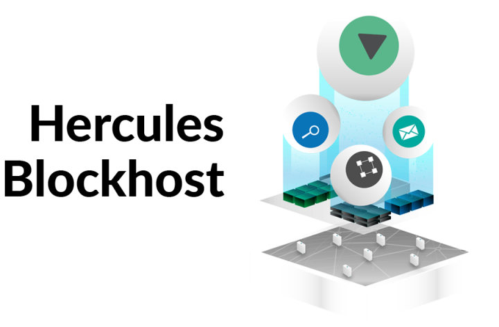

# 3Bot Chat Wizard

The [3Bot](threefold__[3Bot](threefold__3bot_def)_def) Chat Wizard is a feature of the [3Bot](threefold__3bot_def) with what developers and tech savvy people can create interactive chat session to capture enduser input to deploy IT applications.  This chat wizard runs in the private [3Bot](threefold__3bot_def) and presents a private and safe environment to create a personalized and secure application deployment mechanism

<!-- create specific title image -->
<!--  -->

#### Features

- Simple and human readable code
- Simple structure to implement a specific workflow
- Secure facility to allow people that have little technical orientation to start and stop online applications

An examples of what that looks like can be fond [here](https://manual.threefold.io/#/getting_started_network?id=chatflow-steps)
