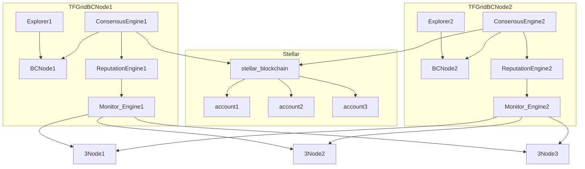

# Consensus Engine

## metadata as needed for consensus engine

- [restricted accounts metadata](tftech__restricted_account_records.md)

## weights for multisignature

We define a logical set of weights to make sure that no party can transfer money unless all conditions are achieved.

### for vesting & locking

- a person account = weight of 5
- 9 signers have weight of 1
- signing weight in total needs to be 10

This means a person holding [TFT](threefold__threefold_token) can not transfer money out unless Consensus engine has signed as well.
This means consensus engine cannot send money out unless person agrees.

## for minting

- ThreeFold asks for the transaction = weight of 5
- 9 signers have weight of 1
- signing weight in total needs to be 10
- the signers are the Guardians of ThreeFold.

## relation with minting

### consensus engine in reltion to minting in TFGrid 3.0

[Consensus Engine](threefold__consensus_engine) checks the following:

- if uptime + 99.5% per month then
  - formula [CPR](threefold__cloud_production_rate) * [CPR](threefold__cloud_production_rate) REWARD / [TFT](threefold__threefold_token) price -> [TFT](threefold__threefold_token) mined
    - CRP reward is prob 60 USD per [CPR](threefold__cloud_production_rate)
- required metadata per account is registered on the parity based [ThreeFold Chain](threefold__tfchain).