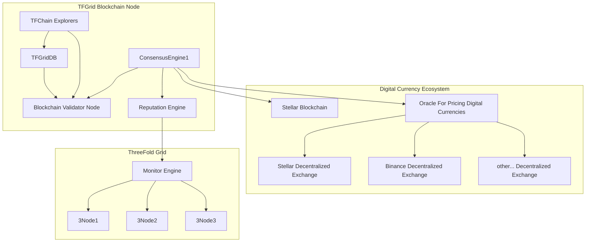

## Consensus 3.0 Oracles used

Oracles are external resources of information.

The [ThreeFold Chain](threefold__tfchain) captures and holds that information so we get more certainty about the accuracy.

We have oracles for price & reputation for e.g. [ThreeFold Farmer](threefold__tf_farming)s and [3Node](threefold__3node)s.

