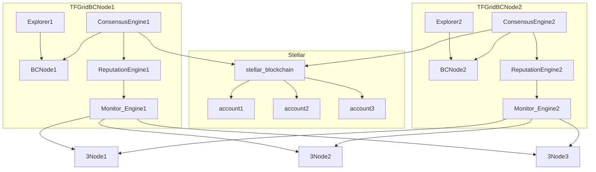

# Consensus Mechanism

## blockchain node components

- blockchain node (parity node) 
- explorer = rest + GraphQL interface to [ThreeFold Chain](threefold__tfchain)
  - graphql is a nice query language to make it easy for everyone to query for info
- consensus engine
  - multisignature engine running on Parity based blockchain (TFChain)
  - multisignature is done for the [Stellar Account](threefold__stellar_account)s
  - checks the [Account Metadata](threefold__account_metadata) versus reality and if ok, will sign, which allows transactions to happen after validation of "smart contract"
- SLA & reputation engine
  - each node uptime is being checked by [Monitor Engine](threefold__monitor_engine)
  - also bandwidth will be checked in the future (starting 3.x)

### remarks

- there are 9 [TFChain Node](threefold__tfchain_node) = each node is operated by a [ThreeFold Grid Guardian](threefold__grid_guardians)
- Each [Monitor Engine](threefold__monitor_engine) checks uptime of X nr of nodes (in beginning it can do all nodes), and stores the info in local DB (to keep history of check)
- [Roadmap for TFChain deployment mechanism](tftech__roadmap_tfchain3.md)

## principle

- we keep things as simple as we can
  - [Stellar Blockchain](threefold__stellar_blockchain) blockchain used to hold the money
    - [Stellar Blockchain](threefold__stellar_blockchain) has all required features to allow users to manage their money like wallet support, decentralized exchange, good reporting, low transaction fees, ...
  - Parity based [ThreeFold Chain](threefold__tfchain) is holding the metadata for the accounts which express what we need to know per account to allow the start contracts to execute.
  - Smart Contracts are implemented using multisignature feature on [Stellar Blockchain](threefold__stellar_blockchain) in combination with Multi Signature done by [Consensus Engine](threefold__consensus_engine).
- on [Stellar Blockchain](threefold__stellar_blockchain):
  - each user has [Stellar Account](threefold__stellar_account)s (each of them holds money)
  - there are normal Accounts (means people can freely transfer money from these accounts) as well as [Restricted Account](threefold__restricted_account)s. Money cannot be transfered out of [Restricted Account](threefold__restricted_account)s unless consensus has been achieved from [Consensus Engine](threefold__consensus_engine).
- [Restricted Account](threefold__restricted_account)
  - on steller we use the multisignature feature to make sure that locked/vesting or FarmingPool cannot transfer money unless consensus is achieved by the [Consensus Engine](threefold__consensus_engine)

- each account on [Stellar Blockchain](threefold__stellar_blockchain) (StellarAccount) has account record in [ThreeFold Chain](threefold__tfchain) who needs advanced features like:
  - lockup
  - vesting
  - minting (rewards to farmers)
  - [TFT](threefold__threefold_token)a to [TFT](threefold__threefold_token) conversion

- account record in [ThreeFold Grid](threefold__threefold_grid) DB is called [Account Metadata](threefold__account_metadata).
  - The [Account Metadata](threefold__account_metadata) describes all info required to be able for consensus engine to define what to do for advanced features like vesting, locking, ...

