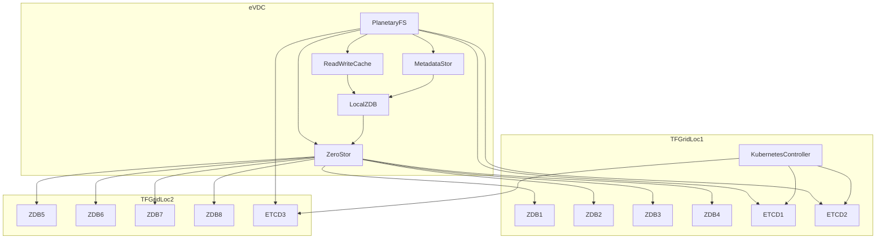
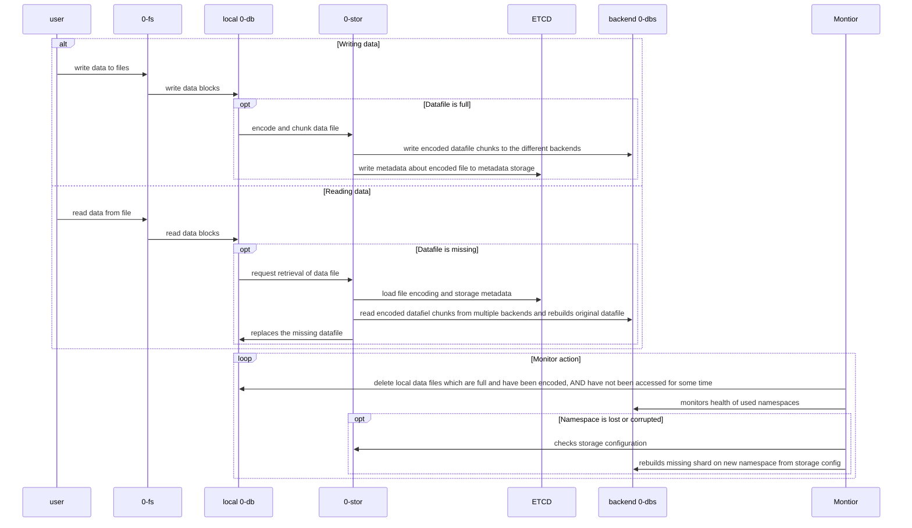

# quantum safe filesystem 2.6

## requirements

- redundancy/uptime
  - data can never be lost if older than 20 min (avg will be 7.5 min, because we use 15 min push)
  - if a datacenter or node goes down and we are in storage policy the storage stays available
- reliability
  - data cannot have hidden data corruption, when bitrot the FS will automatically recover
- self healing
  - when data policy is lower than required level then should re-silver (means make sure policy is intact again)

## NEW

- 100% redundancy

## architecture

## QSFS Architecture

## QSFS Sequence Diagram

