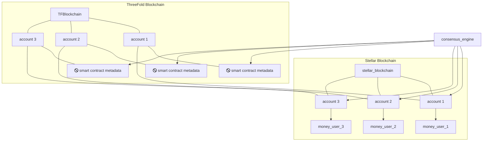

## Link Between Stellar & parity

```mermaid


graph TB
    subgraph Stellar Blockchain
        stellar_blockchain --- account1a
        stellar_blockchain --- account2a
        stellar_blockchain --- account3a
        account1a --> money_user_1
        account2a --> money_user_2
        account3a --> money_user_3
        click stellar_blockchain "/threefold/#stellar_blockchain"

    end
    subgraph ThreeFold Blockchain
        TFBlockchain --- account1b[account 1]
        TFBlockchain --- account2b[account 2]
        TFBlockchain --- account3b[account 3]
        account1b --- smart_contract_data_1
        account2b --- smart_contract_data_2
        account3b --- smart_contract_data_3
        click TFBlockchain "/threefold/#tfchain"
    end

    account1b ---- account1a[account 1]
    account2b ---- account2a[account 2]
    account3b ---- account3a[account 3]

    consensus_engine --> smart_contract_data_1[fa:fa-ban smart contract metadata]
    consensus_engine --> smart_contract_data_2[fa:fa-ban smart contract metadata ]
    consensus_engine --> smart_contract_data_3[fa:fa-ban smart contract metadata]
    consensus_engine --> account1a
    consensus_engine --> account2a
    consensus_engine --> account3a
    click consensus_engine "/threefold/#consensus_engine"


```