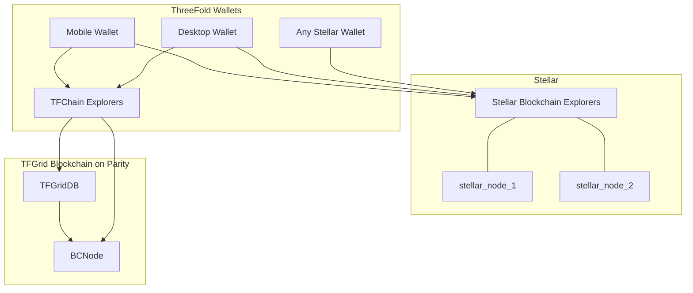
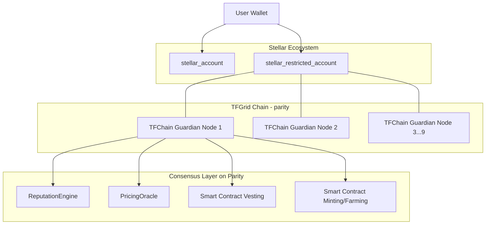

# TFGrid 3.0 Wallets

ThreeFold has a mobile wallet which will be compatible with the [ThreeFold Chain](threefold__tfchain) backend (Parity) as well as [Stellar Blockchain](threefold__stellar_blockchain) (like it is today).

This provides for a very secure digital currency infrastructure with lots of advantages.

- [X] ultra flexible smart contracts possible 
- [X] super safe
- [X] compatible with multiple blockchains (money blockchains)
- [X] ultra scalable

Generic overview:

